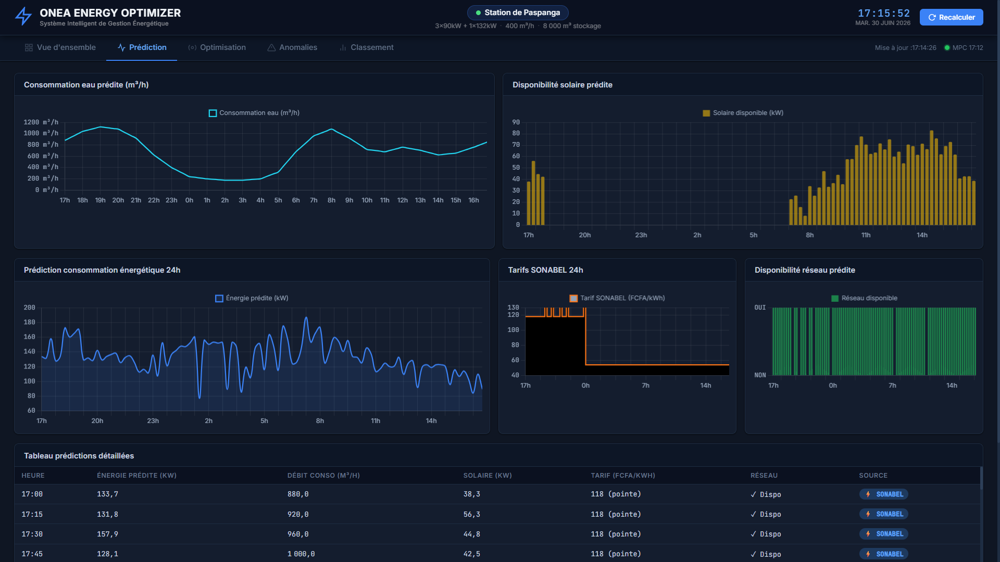
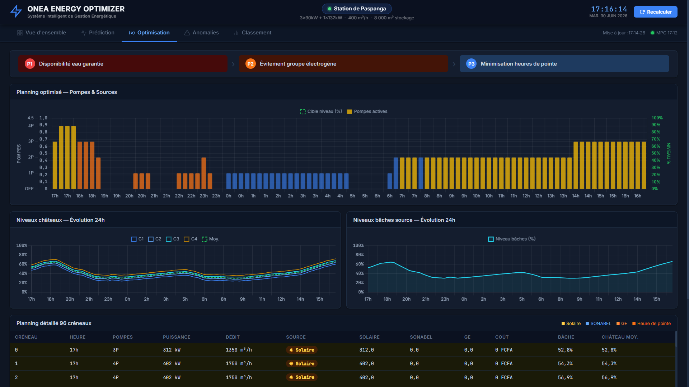
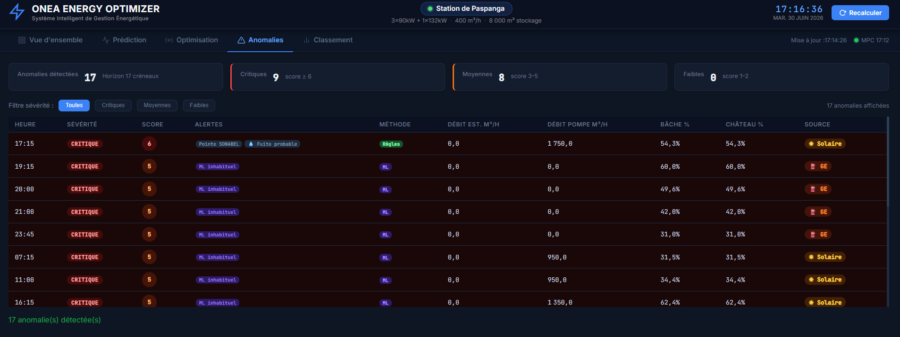

# ONEA Energy Optimizer — Station de Paspanga

Projet Flask de gestion énergétique pour la station de pompage Paspanga.
Ce projet combine prévision, optimisation MPC, détection d'anomalies et simulation temps réel.


## Fonctionnalités principales

- Prévision de la demande, de la production solaire et des tarifs horaires.
- Optimisation de la planification de pompage avec un schéma MPC (Rolling Horizon).
- Détection d'anomalies par règles expertes et Isolation Forest.
- Simulation temps réel de l'état hydraulique avec événements injectables.
- Tableau de bord web et API REST pour visualiser les KPI et les résultats.

## Architecture

- `app.py` : serveur Flask + gestion du cycle MPC + API.
- `modules/module1_prediction.py` : module de prédiction énergétique.
- `modules/module2_optimization.py` : module MPC / optimisation des pompes.
- `modules/module3_anomalies.py` : module de détection d'anomalies.
- `modules/simulator.py` : simulateur temps réel / jumeau numérique.
- `templates/index.html` : interface utilisateur.
- `static/dashboard.js` : logique du dashboard.
- `static/style.css` : styles de l'interface.
- `models/` : modèles machine learning sauvegardés.
- `data/` : fichiers JSON générés automatiquement.

## Prérequis

- Python 3.10 ou supérieur
- `pip`
- Navigateur web moderne (Chrome, Firefox, Edge)

## Installation

1. Cloner le dépôt ou extraire l'archive.

```bash
git clone <url-du-depot>
cd "ONEA ENERGY OPTIMIZER"
```

2. Créer un environnement virtuel.

```bash
python -m venv venv
venv\Scripts\activate
```

3. Installer les dépendances.

```bash
pip install -r requirements.txt
```

## Lancer le projet

```bash
python app.py
```

Le serveur démarre sur `http://localhost:5000`.
Au premier démarrage, le projet initialise automatiquement les modules et crée les fichiers JSON dans `data/`.

## Structure du projet

```
PROJET ONEA ENERGY OPTIMIZER - Sobre/
├── app.py
├── requirements.txt
├── README.md
├── models/
│   └── model_metadata_paspanga.json
├── modules/
│   ├── module1_prediction.py
│   ├── module2_optimization.py
│   ├── module3_anomalies.py
│   └── simulator.py
├── templates/
│   └── index.html
├── static/
│   ├── dashboard.js
│   └── style.css
└── data/  # créé automatiquement au premier lancement
```

## Modules détaillés

### Module 1 — Prédiction énergétique

- Calcul des prévisions 24h en pas de 15 minutes.
- Utilise un Random Forest pour la consommation et la production solaire.
- Intègre le calendrier du Burkina Faso (`holidays`) et le Ramadan (`hijridate`).
- Génère `data/predictions.json` et `data/module2_interface.json`.



### Module 2 — Optimisation MPC du pompage

- Lit les paramètres de `data/module2_interface.json`.
- Reconstruit les caractéristiques des pompes et les contraintes hydrauliques.
- Résout un problème MILP avec `pulp`.
- Génère `data/pump_schedule.json` et `data/mpc_metrics.json`.



### Module 3 — Détection d'anomalies

- Combine des règles métiers et un modèle `IsolationForest`.
- Analyse les données issues des modules 1 et 2.
- Génère `data/anomalies.json`.



### Module 4 — Simulateur temps réel

- Simule un état hydraulique réel à partir de `data/pump_schedule.json`.
- Crée `data/realtime_state.json` et `data/realtime_history.json`.
- Permet d'injecter des événements (`data/simulator_events.json`).

## API REST

| Méthode | Route | Description |
|--------|-------|-------------|
| GET | `/` | Dashboard web |
| GET | `/api/kpi` | KPI synthétiques |
| GET | `/api/predictions` | Prévisions énergétiques |
| GET | `/api/schedule` | Planning des pompes |
| GET | `/api/metrics` | Métriques MPC |
| GET | `/api/interface` | Données d'interface module 2 |
| GET | `/api/anomalies` | Anomalies détectées |
| GET | `/api/realtime` | État réel simulé courant |
| GET | `/api/realtime/history` | Historique 24h du simulateur |
| GET | `/api/realtime/events` | Événements simulateur actifs |
| POST | `/api/realtime/events` | Mettre à jour les événements simulateur |
| POST | `/api/regenerate` | Relancer M2 + M3 + M4 immédiatement |
| GET | `/api/system` | Statut du cycle MPC |
| GET | `/api/ranking` | Classement des stations (si disponible) |

### Exemple d’événement simulateur

```json
{
  "fuite_m3h": 15,
  "pompe_en_panne": true,
  "capteur_bache_ko": false
}
```

## Personnalisation

- `data/module2_interface.json` contient les paramètres d'entrée pour le module 2.
- `data/simulator_events.json` contient les événements injectables du simulateur.

## Réinitialisation complète

Supprimer les fichiers JSON du répertoire `data/` puis relancer le serveur pour forcer la régénération :

```bash
rm -rf data/*.json
python app.py
```

> Sur Windows, utilisez `del` ou supprimez les fichiers depuis l'explorateur si nécessaire.

## Dépendances

- `apscheduler`
- `flask`
- `holidays`
- `hijridate`
- `joblib`
- `numpy`
- `pandas`
- `pulp`
- `scikit-learn`

## Notes

- Le serveur exécute automatiquement le cycle MPC toutes les 15 minutes.
- Le pilote `app.py` initialise les données manquantes puis démarre le scheduler.
- Le tableau de bord et l'API sont conçus pour un usage local et une démonstration GitHub.


© 2026 ONEA Energy Optimizer. Tous droits réservés.
